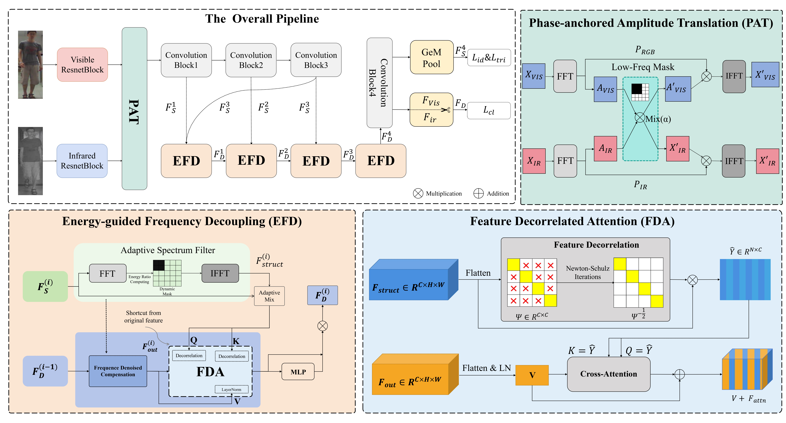

# SF2DNet: Spatial-rectification and Frequency-decoupling with Feature decorrelation Network

Official PyTorch implementation of the paper **"Spatial-rectification and Frequency-decoupling with Feature decorrelation Network for Visible-Infrared Person Re-Identification"**.



## Overview

We propose **SF²DNet**, a novel framework for VI-ReID that bridges the cross-modality gap through synergistic spatial-frequency optimization. Our method comprises three core modules:

- **PAT (Phase-anchored Amplitude Translation):** Performs modality-agnostic style translation.
- **EFD (Energy-guided Frequency Decoupling):** Dynamically filters modality-specific noise.
- **FDA (Feature Decorrelation Attention):** Eliminates inter-channel covariance redundancy.

## 1. Requirements

Our experiments are conducted under the following environments:

- Python 3.8
- Pytorch == 2.1.2
- torchvision == 0.16.2

## 2. Datasets

- **RegDB** [1]: The RegDB dataset can be downloaded from this [website](http://dm.dongguk.edu/link.html).

- **SYSU-MM01** [2]: The SYSU-MM01 dataset can be downloaded from this [website](http://isee.sysu.edu.cn/project/RGBIRReID.htm).

  - run `python pre_process_sysu.py` to prepare the dataset, the training data will be stored in ".npy" format.

    ```
    python pre_process_sysu.py
    ```

- **LLCM** [4]: The LLCM dataset can be downloaded by sending a signed [dataset release agreement](https://github.com/ZYK100/LLCM/blob/main/Agreement/LLCM%20DATASET%20RELEASE%20AGREEMENT.pdf) copy to zhangyk@stu.xmu.edu.cn.


## 3. Training

**Train SF²DNet by**

```
python train.py --dataset sysu --gpu 0
```

- `--dataset`: which dataset "sysu", "regdb" or "llcm".

- `--gpu`: which gpu to run.

*You may need manually define the data path first.*


## 4. Testing

**Test a model on SYSU-MM01 dataset by**

```
python test.py --dataset 'sysu' --mode 'all' --resume 'model_path'  --gpu 0
```

  - `--dataset`: which dataset "sysu" or "regdb".
  - `--mode`: "all" or "indoor"  (only for sysu dataset).
  - `--resume`: the saved model path.
  - `--gpu`: which gpu to use.


**Test a model on RegDB dataset by**

```
python test.py --dataset 'regdb' --resume 'model_path'  --tvsearch True --gpu 0
```

  - `--tvsearch`:  whether thermal to visible search  True or False (only for regdb dataset).


**Test a model on LLCM dataset by**

```
python test.py --dataset 'llcm' --resume 'model_path'  --gpu 0
```


## 5. Results

We adopt **ResNet-50** as backbone with ImageNet pretrained weights.

| Datasets | Backbone | Rank@1 | Rank@10 |  mAP   | 
| :------: | :------: | :----: | :-----: | :-----: | 
|  SYSU-MM01   |   ResNet-50    | 82.36% | 98.11%  | 77.07% | 
|  RegDB   |   ResNet-50    | 95.24% | -  | 92.52% | 
|  LLCM   |   ResNet-50    | 67.56% | -  | 68.93% |

**\*The results may exhibit fluctuations due to random splitting, and further improvement can be achieved by fine-tuning the hyperparameters.**


## 6. Citation

This project is built upon the [IRL](https://github.com/Mapzzone/2025-ACMMM-IRL) (Low-light Invariant Representation Learning) framework [3]. The code related to LLCM dataset is borrowed from [DEEN](https://github.com/ZYK100/LLCM) [4].

Thanks a lot for the authors' contribution.


##  References

[1] D. T. Nguyen, H. G. Hong, K. W. Kim, and K. R. Park. Person recognition system based on a combination of body images from visible light and thermal cameras. Sensors, 17(3):605, 2017.

[2] A. Wu, W.-s. Zheng, H.-X. Yu, S. Gong, and J. Lai. Rgb-infrared crossmodality person re-identification. In IEEE International Conference on Computer Vision (ICCV), pages 5380–5389, 2017.

[3] Wang D, Xing G, Liu Y. Low-light Invariant Representation Learning for Visible-Infrared Person Re-identification[C]//Proceedings of the 33rd ACM International Conference on Multimedia. 2025: 8645-8653.

[4] Zhang Y, Wang H. Diverse Embedding Expansion Network and Low-Light Cross-Modality Benchmark for Visible-Infrared Person Re-identification[C]//Proceedings of the IEEE/CVF Conference on Computer Vision and Pattern Recognition. 2023: 2153-2162.
